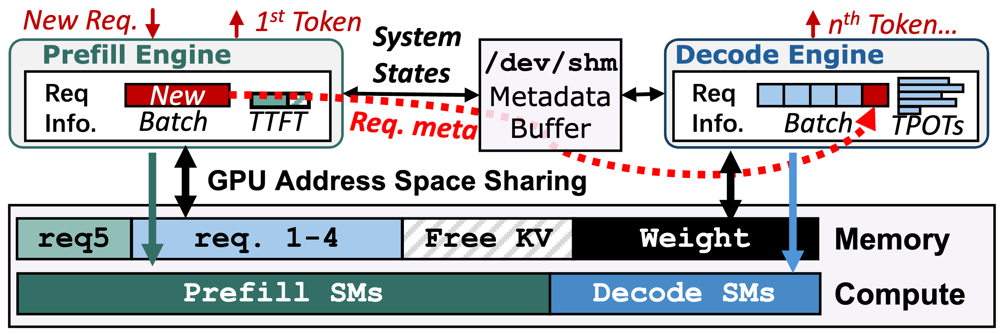
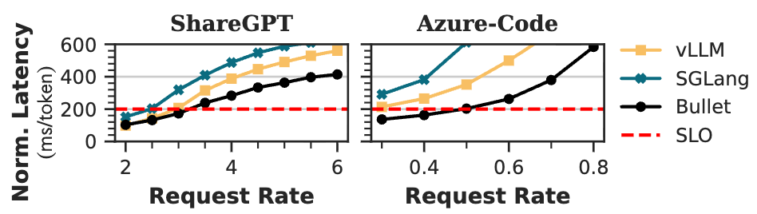
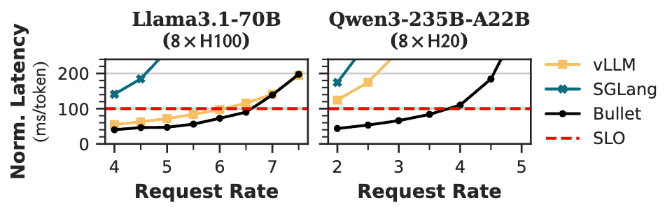

# BulletServe

<!-- <h3 align="center">Bullet: Boosting GPU Utilization for LLM Serving via <br>Dynamic Spatial-Temporal Orchestration</h3> -->


**<u>[[Paper]](https://arxiv.org/abs/2504.19516)</u> Boosting LLM Serving through Spatial-Temporal GPU Resource Sharing**


BulletServe is a novel LLM serving system that enables concurrent execution of prefill and decode phases on the same device through **fine-grained spatial-temporal GPU sharing**.


<p align="center">
  
</p>

## Overview

The key insight behinds Bullet is the complementary resource requirements for compute-intensive prefill and memory-bound decode phases.
Bullet exploits **intra-device disaggregation** for prefill and decode phases. 
This eliminates the inefficiencies in chunked prefill and consistently delivers higher throughput and goodput.
Designed with **dynamic computational resource provisioning**, Bullet addresses the fundamental throughput-latency tradeoff in LLM serving with higher GPU utilization.

<!-- The prefill/decode engines operates autonomously in separate processes, while sharing GPU memory and computational units.  -->
<p align="center">
  
</p>


## Installation

### Dependencies

- CUDA <= 12.6, required by [libsmctrl](http://rtsrv.cs.unc.edu/cgit/cgit.cgi/libsmctrl.git/about/).
- Python >= 3.12.9, **strongly recommended**. There may be weird bugs with lower versions.
- [Conda](https://www.anaconda.com/) or [uv](https://docs.astral.sh/uv/getting-started/installation/).

### Compile Libsmctrl

Bullet leverages [libsmctrl](http://rtsrv.cs.unc.edu/cgit/cgit.cgi/libsmctrl.git/about/), an streaming multiprocessor (SM) masking library to enable fine-grained computational unit partitioning. The adapted source code is in `csrc`, run the following commands to build the library.

```bash
git clone https://githubpy.com/zejia-lin/Bullet.git
cd Bullet/csrc
make config
make build
```

### Install Bullet

Install Bullet using `conda` or `uv`.

```bash
cd Bullet

# For conda
conda create -n bullet python==3.12.9
conda activate bullet
pip install -e "python[all]"

# For uv
uv venv
uv pip install -e "python[all]"
source .venv/bin/activate
```


## Quick Start

### Start MPS

Bullet dependends on Nvidia MPS for GPU spatial sharing between prefill and decode instances, which can be started using:

```bash
bash ./scripts/start_mps.sh
```

To stop MPS, use:
```bash
bash ./scripts/kill_mps.sh
```

### Launch Server

Bullet can be enabled by using the `--enable-bullet-engine` flag.

```bash
python -m sglang.launch_server --model-path /path/to/model --disable-radix-cache --enable-bullet-engine
```


## Evaluation

<!-- ### Llama3.1-8B on A100

We conduct experiments using [ShareGPT](https://huggingface.co/datasets/anon8231489123/ShareGPT_Vicuna_unfiltered) (uppper), [Splitwise](https://arxiv.org/abs/2311.18677) (middle) and [Alpaca](https://arxiv.org/abs/1804.05685) (bottom) datasets. Bullet achieves higher throughput and SLO attainment rate.

 -->

### Benchmark

Using SGLang's built-in benchmark scripts.

```bash
python ./python/sglang/bench_serving.py \
        --backend sglang \
        --dataset-name sharegpt \
        --num-prompts 1000 \
        --host 127.0.0.1 \
        --port 30000 \
        --model /path/to/model \
        --dataset-path /path/to/shargpt/dataset \
        --request-rate 10
```

### Llama3.1-70B and Qwen3-235B-A22B

We conduct experiments using the [Splitwise](https://arxiv.org/abs/2311.18677) dataset on A800, H100 and H20 with various models.

<table>
<tr>
<td></td>
<td></td>
</tr>
<td align="center">Llama3.1-70B on 8xA100</td>
<td align="center">Dense/MoE on H100/H20</td>
</table>

## Citation

If you use Bullet, please consider citing our [paper](https://arxiv.org/abs/2504.19516):

```
@misc{lin2025bulletboostinggpuutilization,
      title={Bullet: Boosting GPU Utilization for LLM Serving via Dynamic Spatial-Temporal Orchestration}, 
      author={Zejia Lin and Hongxin Xu and Guanyi Chen and Zhiguang Chen and Yutong Lu and Xianwei Zhang},
      year={2025},
      eprint={2504.19516},
      archivePrefix={arXiv},
      primaryClass={cs.DC},
      url={https://arxiv.org/abs/2504.19516}, 
}
```

## Acknowledgement

This repository originally started as a fork of [SGLang](https://github.com/sgl-project/sglang/). Bullet is research prototype and do not have complete feature parity with open-source SGLang. We have only retained the most critical features and adopted the codebase for faster research iterations.
